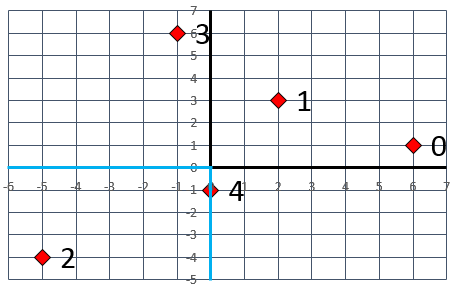
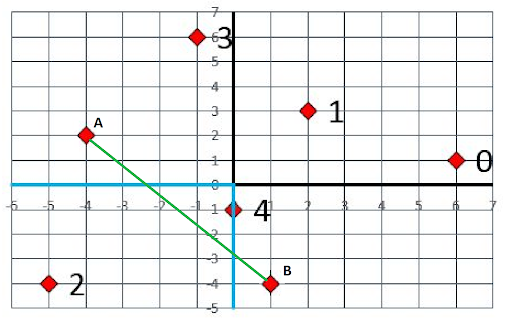

(this is not part of the license)

Project descriptions:

# EECS 281: Project 4 - Zookeeper

***Due Tuesday December 5, 2023 before midnight\***

## Overview

You will be given a graph as a collection of x-y coordinates (vertices) and a rule or rules about how they are connected (edges). This project has three parts:

- [Part A](https://eecs281staff.github.io/p4-zoo/#part-a-mst-mode): Calculate a [Minimum Spanning Tree (MST)](https://en.wikipedia.org/wiki/Minimum_spanning_tree) to find the subset of edges that represent lowest edge weight cost to connect all vertices.
- [Part B](https://eecs281staff.github.io/p4-zoo/#part-b-fasttsp-mode): Research and implement an algorithm to approximate a solution to the [Travelling Salesperson Problem (TSP)](https://en.wikipedia.org/wiki/Travelling_salesperson_problem); the solution need not be optimal, but it must be “close enough” and “fast enough” to satisfy the autograder.
- [Part C](https://eecs281staff.github.io/p4-zoo/#part-c-opttsp-mode): Calculate the weight of an optimal TSP solution, using a branch and bound algorithm.

### Project Goals

- Understand and implement MST algorithms
- Be able to determine whether Prim’s Algorithm or Kruskal’s Algorithm is more efficient for a particular scenario
- Understand and implement a Branch and Bound algorithm
- Develop a fast and effective bounding algorithm for the TSP
- Explore various heuristic approaches to quickly achieving a nearly-optimal solution
- Research online to identify, learn, and implement various “TSP heuristics”
- Use a graph visualization tool to help with debugging

### Backstory (for fun)

You are a zookeeper caring for a large number of animals. Everyday, you (the zookeeper) should provide food and water for the animals. In order to minimize the expenses of the zoo, you are planning to devise a systematic way to feed the animals. Your plan is to first make paths to each animal cage to deliver food, and then to construct canals to provide fresh water to all animal cages. Your task is to identify the most efficient routes for providing food and water to the animals.

In part A we only try to make paths to the cages to feed the animals and our goals are to minimize the expenses of building paths and to find the most efficient routes. In parts B and C, we try to find the the most cost efficient routes for constructing water canals to the cages. In order to have water flow within the canals, the route should be a cycle.

To be clear: these scenarios are separate; the program will create a plan for one or the other, but not both in the same run (though you may find that the algorithms from one mode help with another mode).

In this project, your output does not need to be exactly the same as ours to be correct. As long as it provides a valid answer, and follows the rules for formatting output, it can be different and still be correct.

## Common Project Elements

The specific parts of the project will be described in detail below, but there are some common elements that will be used in all parts of the project.

### Command Line Arguments

Your program, `zoo`, should take the following case-sensitive command line options:

- -m, –mode {MST|FASTTSP|OPTTSP}
  - MST: Find the minimum spanning tree (MST) of the map
  - FASTTSP: Find a fast, but not necessarily optimal, solution to the TSP
  - OPTTSP: Find the optimal solution to the TSP

This command line option is required and has a required argument. If it is not properly included, print a useful error message to standard error (`cerr`) and `exit(1)`. Program output format is dictated by given `mode`.

All of modes share the same input format, but only one mode will be tested at a time. Your program should be able to handle all three modes, but each call to your program will only test one mode. You may find that one mode will be helpful when implementing another mode, but you need only supply one final answer for each mode.

- -h, –help

Print a short description of this program and its arguments and `exit(0)`.

Valid examples of how to execute the program:

Valid Command Line Examples

|      | $ ./zoo --mode MST                 (OK, but you must type the input by hand) |
| ---- | ------------------------------------------------------------ |
|      | ...                                                          |
|      | $ ./zoo -h < inputFile.txt         (OK, -h happens before we realize there’s no -m) |
|      | ...                                                          |
|      | $ ./zoo -m OPTTSP < inputFile.txt  (OK, redirects input from a file on disk) |
|      | ...                                                          |

When input redirection is used it is handled by the shell, and it neither affects nor can be seen by the command line. Redirecting input sends the contents of the file specified to the program via `cin`. You should not have to modify your code to allow this to work; the operating system will handle it.

We will not be specifically error-checking your command-line handling, however we expect that your program conforms with the default behavior of `getopt_long()`. Incorrect command-line handling may lead to a variety of difficult-to-diagnose problems.

### Input File Format

On startup, your program reads graph vertices from standard input (`cin`). These vertices are animal cage locations (to go along with the backstory described above). The map can be represented as a cartesian plane, and you will be given an integer, �, denoting how many vertices are in the graph. This will be followed by � ordered pairs of integers describing points on the Cartesian plane, one per line, delimited by a single space.

Vertices are identified by integer indices which correspond to the order in which they are read in (the first vertex is vertex 0, the second vertex is vertex 1, etc.). The input will always be well-formed and conform to this format, so there is no need to error check. There may be additional blank lines, but only at the end of the file.

Map Input Sample (p4-zoo/spec-test.txt)

|      | 5     |
| ---- | ----- |
|      | 6 1   |
|      | 2 3   |
|      | -5 -4 |
|      | -1 6  |
|      | 0 -1  |

### Map Areas

The map will be divided into three areas: wild animals (QIII in the Cartesian plane), other (safer) animals (QI, QII, and QIV), and the wall between them (origin plus negative x- and y-axes). Animal cages can appear in any of these areas, and each cage can only be in one area. When a cage’s area is important ([Part A](https://eecs281staff.github.io/p4-zoo/#part-a-mst-mode)), it can be stored with its coordinates if done efficiently. Choosing to do so is optional and a great example of a trade-off between space and time, where the additional space used to store the area of a cage can help save time when evaluating the areas of two cages, for the purpose of calculating the distance between them.

**Pro tip:** When categorizing vertices, remember the analysis of binary search, where the earliest comparison was used to gain the largest amount of information, and the least likely outcome was saved for last without any specific conditionals needed. This is a two-dimensional graph, so multiple comparisons and logical combinations are needed, but the same idea applies and can be used to simplify your code.

Ask, “What single comparison can I make that will give me the most information about the location of a vertex?” and “What is the least likely outcome of that comparison?”. The answers to these questions will help you determine the order in which to make comparisons, and how to combine them.

The sample above can be visualized as in the figure below, where the numbers shown are the cage indices and the blue line indicates the wall which separates the wild animals from the other animals. Cage 2 is a wild animal cage, cage 4 is in the wall, and the rest of the cages are other animal cages.



There is more than one way to represent this configuration internally in your program, and this will affect your runtime. Choose your data structures wisely!

### Output and the Autograder

In this project, your output does not need to be exactly the same as ours to be correct. As long as your output provides a valid tree- or path-weight and follows formatting rules, it can be a different tree or path and still be correct. Alternatively, your solution may find a tree or path identical to the one on the autograder and print it in a different order, and still be correct. Anything that is judged as correct will be give full points and not be penalized for being different from the autograder.

### Distance Calculations

To calculate the distance between two points use [Euclidean Distance](https://en.wikipedia.org/wiki/Euclidean_distance), �=(�1−�2)2+(�1−�2)2, and store distances as `double`s. Please be very careful with rounding errors in your distance calculations; the autograder will allow you a 0.01 margin of error to account for rounding, but you should only round values during output, not during intermediate steps.

**Pro tips:**

1. Using `pow()` to calculate the square of a number is not necessary, and can be avoided by using the multiplication operator. For example, `pow(x, 2)` can be written as `x * x` which executes faster.
2. Be thoughtful about intermediate calculations which may overflow the range of an `int` before they are stored in the output `double`.
3. `sqrt()` is a relatively slow function, and may be avoided if you consider the following: if �<� then �<�. The same cannot be said when sums are involved, so �+�<�+� does not guarantee that �+�<�+�, so should not be used.

When you are building canals (in Parts B and C), you can directly connect wild animal cages to other animal cages without connecting through a cage in the wall, and vice versa; in other words, you may ignore the wall constraint.

## Part A: MST mode

In this mode you will devise an animal cage path network (MST) that connects all of the cages, while minimizing the total length of connections needed. You may use any MST algorithm to connect all the cages. Hint: Unless you want to implement both and compare, think about the nature of the graph (how many vertices and edges does it have?). You are free to adapt code from the lecture slides to fit this project, but you will want to carefully think about the data structures necessary to do each part (storing unnecessary data can go over memory limits). Your program must always generate one valid MST for each valid input.

When connecting cages in Part A, movement is only allowed between cages in the same area (see [Map Areas](https://eecs281staff.github.io/p4-zoo/#map-areas)). Travel to a wild animal cage from an other animal cage must go through a wall cage, similarly for travel to an other animal cage from a wild animal cage. For example, you are not allowed to travel directly from (-5, -4) to (6, 1). You must first travel from (-5, -4) to (0, -1), and then from (0, -1) to (6, 1).

For the sake of simplicity, assume any travel between two other animal cages with a direct connection that goes “through” the wild animal cage area, will be accomplished by an elevated walkway without wall restrictions. The example below shows two validly connected cages, A and B.



### Part A Distances

The distance between any two cages in the same area, or between any wild or other animal cage and a cage in the wall, is the Euclidean distance between the two cages. The distance between any wild animal cage and an other animal cage is effectively infinite, since you cannot travel directly between the two areas.

### Part A Graph Representation

MST Mode may have a minimum of two vertices but the autograder will also run tests with tens of thousands of cages. A distance matrix with |�|2 `double` values is not guaranteed to fit in memory. Since you cannot afford enough space that would allow look up of edge weights, you will have to calculate the distances between cages as you need them.

### Part A Output Format

For the MST mode, you should print the total weight of the MST you generate by itself on a line; this weight is the sum of the weights of all edges in your MST (in terms of Euclidean distance). You should then print all edges in the MST. All output should be printed to standard output (`cout`).

The output should be of the format:

Sample Output Format

|      | weight    |
| ---- | --------- |
|      | node node |
|      | node node |
|      | ......    |

Here, `node` is a cage index corresponding to the vertices of the MST, and a pair of nodes on a given line of the output describes an edge in the MST from the first node to the second. The weight should be formatted as a double (2 decimal point precision is enough - see Appendix A), and the node numbers should all be integer values when printed. For example, given the example input file above, your MST mode output might be:

TODO Appendix A reference above

MST Sample Output (p4-zoo/spec-test-MST-out.txt)

|      | 19.02 |
| ---- | ----- |
|      | 0 1   |
|      | 2 4   |
|      | 1 3   |
|      | 1 4   |

You should also always print the pairs of vertices that describe an edge such that the index on the left has a smaller integer value than the index on the right. In other words:

```
1 2
```

is a possible valid edge of output, but

```
2 1
```

is not valid output.

If it is not possible to construct an MST for the given cages because there are cages both in the other animal area and in wild animal area with no wall cages, your program should print the message “Cannot construct MST” to `cerr` and `exit(1)`.

## Part B: FASTTSP Mode

In this mode, you will figure out how to build water canals that connect all cages in all areas, in a continuous loop. You will be implementing solutions to the [Travelling Salesperson Problem (TSP)](https://en.wikipedia.org/wiki/Travelling_salesperson_problem). The canal will always start at the first cage in the file (index 0), visit every other cage exactly once, and return to the starting point. You must solve the TSP and choose paths to cages so as to minimize the total distance travelled.

In FASTTSP mode there can be large numbers of possible cages to visit, finding an optimal method for visiting all of them may be too slow, and the sun may cool before you are able to complete your task. You can use heuristics instead to find nearly-optimal tours. A heuristic is a problem-solving method (an algorithm) that can produce a good answer that is not necessarily the best answer. For example, you can skip a branch speculatively rather than waiting to know for a fact that it can be skipped. There are many other simple heuristic techniques, such as starting with a random tour and trying to improve it by small changes. Do some online searching for “TSP heuristics”. There are several types, some easier to implement, some with better path lengths, some both. Make sure that you choose and implement an algorithm that is �(�2).

You should produce a TSP solution that is a close approximation to the optimal tour length. Given the time constraint, you will be unable to reliably find the optimal solution, though in lucky situations (depending on the graph and the algorithm chosen) the optimal solution may be found occasionally.

You are allowed to use any combination of algorithms for this section that we have covered in class, including the MST algorithm you wrote for Part A.

You will need to be creative when designing your algorithms for this section. You are free to implement any other algorithm you choose, so long as it meets the time and memory constraints. However, you should not use any advanced algorithms or formulas (such as Simulated Annealing, Genetic Algorithms and Tabu search - they are too slow) that are significantly different from what has been covered in class. Instead, creatively combine the algorithms that you already know and come up with concise optimizations. Your heuristic will very likely be greedy in some way, but there are different ways to be greedy!

### Part B Distances

The distance between any two cages is the Euclidean distance between the two cages.

The length of a tour is defined as the sum of all pairwise distances travelled - that is, the sum of the lengths of all edges taken.

### Part B Graph Representation

FASTTSP Mode may have a minimum of three vertices but the autograder will also run tests with tens of thousands of cages. A distance matrix with |�|2 `double` values is not guaranteed to fit in memory. Since you cannot afford enough space that would allow look up of edge weights, you will have to calculate the distances between cages as you need them.

### Part B Output Format

You should begin your output by printing the overall length of your tour on a line by itself. On the next line, output the nodes in the order in which you visit them. The initial node should be the starting cage index and the last node should be the cage number directly before returning back to the 0-th cage. The nodes in your tour should be printed such that they are separated by a single space. There can be a space after the last cage listed. All output should be printed to standard output (`cout`).

For example, if given the input file above, your program could produce either of the following correct outputs:

FASTTSP Sample Output (p4-zoo/spec-test-FASTTSP-out.txt)

|      | 31.64     |
| ---- | --------- |
|      | 0 4 2 3 1 |

or

FASTTSP Alternate Sample Output

|      | 31.64     |
| ---- | --------- |
|      | 0 1 3 2 4 |

## Part C: OPTTSP Mode

See [Part B](https://eecs281staff.github.io/p4-zoo/#part-b-fasttsp-mode) for a description of the TSP problem. In this mode, you will be implementing a solution to the TSP that is guaranteed to be optimal. You will use `genPerms()` to find a route that will always start at cage index 0, visit every other cage exactly once, and return to the starting point. You must solve the TSP and choose edges to connect cages so as to minimize the total distance travelled.

To find an optimal tour, you could start with the brute force method of exhaustive enumeration that evaluates every tour and picks a smallest tour. By structuring this enumeration in a clever way, you could determine that some branches of the search cannot lead to optimal solutions. For example, you could compute lower bounds on the length of any full tour that can be found in a given branch. If such a lower bound exceeds the cost of a full solution you have found previously, you can skip this branch as hopeless. If implemented correctly, such a branch-and-bound method should always produce an optimal solution. It will not scale as well as sorting or searching algorithms do for other problems, but it should be usable with a small number of cages. Clever optimizations (identifying hopeless branches of search early) can make your algorithm a hundred times faster. Drawing TSP tours on paper and solving small cage configurations to optimality by hand should be very useful. Remember that there is a tradeoff between the time it takes to run your bounding function and the number of branches that bound lets you prune.

**MAKE SURE** that you use the version of `genPerms()` that uses `swap()` and a single container, rather than the two-container version (stack \amp; queue) that is much slower.

Given an input set of � cages defined by integer coordinates, your job is to produce an optimal tour using a branch-and-bound algorithm. Your program should always produce the shortest possible tour as a solution, even if computing that solution is time-consuming. You will be given a 35-second cpu time limit to generate your solution. If your program does not produce a valid solution, it will fail the test case. Your solution will also be judged by time and space budgets as per previous projects.

### Part C Distances

Same as [Part B Distances](https://eecs281staff.github.io/p4-zoo/#part-b-distances).

### Part C Graph Representation

OPTTSP Mode may have a minimum of three vertices but, due to time constraints, the autograder will only run tests with a few dozen cages. A distance matrix with |�|2 `double` values will fit in memory, so you can afford enough space to allow precalculation of all edge weights. However, in testing this is not significantly faster than calculating them as needed, and in some cases can make it harder to code. We’ve coded this both with and without a distance matrix, and both versions earned full points.

### Part C Output Format

Same as [Part B Output Format](https://eecs281staff.github.io/p4-zoo/#part-b-output-format).

## Testing and Debugging

Part of this project is to prepare several test files that will expose defects in buggy solutions - your own or someone else’s. As this should be useful for testing and debugging your programs, we recommend that you first try to catch a few of our intentionally-buggy solutions with your test files, before completing your solution. The autograder will also tell you if one of your own test files exposes bugs in your solution.

Each test that you submit should consist of an input file. When we run your test files on one of intentionally-buggy project solutions, we compare the output to that of a correct project solution. If the outputs differ, the test file is said to expose that bug.

Test files should be named test-n-MODE.txt where 1≤�≤10. The autograder’s buggy solutions will run your test files in the specified MODE. The mode must be MST, FASTTSP, or OPTTSP.

Your test files may have no more than 10 coordinates in any one file. You may submit up to 10 test files (though it is possible to get full credit with fewer test files). The tests the autograder runs on your solution are NOT limited to 10 coordinates in a file; your solution should not impose any size limits (as long as sufficient system memory is available).

## Submitting to the Autograder

Do all of your work (with all needed source code files, as well as test files) in some directory other than your home directory. This will be your “submit directory”. Before you turn in your code, be sure that:

- Every source code and header file contains the following project identifier in a comment at the top of the file:
  `// Project Identifier: 3E33912F8BAA7542FC4A1585D2DB6FE0312725B9`
- The Makefile must also have this identifier (in the first TODO block)
- You have deleted all .o files and your executable(s). Typing ‘make clean’ shall accomplish this.
- Your makefile is called Makefile. Typing ‘make -R -r release’ builds your code without errors and generates an executable file called `zoo`. The command-line options -R and -r disable automatic build rules, which will not work on the autograder.
- Your Makefile specifies that you are compiling with the gcc optimization option -O3. This is extremely important for getting all of the performance points, as -O3 can speed up code by an order of magnitude.
- Your test files are named test-n-MODE.txt and no other project file names begin with test. Up to 10 test files may be submitted. The “mode” portion of the filename must be MST, OPTTSP or FASTTSP.
- The total size of your program and test files does not exceed 2MB.
- You don’t have any unnecessary files (including temporary files created by your text editor and compiler, etc) or subdirectories in your submit directory (i.e. the .git folder used by git source code management).
- Your code compiles and runs correctly using version 11.3.0 of the g++ compiler. This is available on the CAEN Linux systems (that you can access via login.engin.umich.edu). Even if everything seems to work on another operating system or with different versions of GCC, the course staff will not support anything other than GCC 11.3.0 running on Linux (students using other compilers and OS did observe incompatibilities). To compile with g++ version 11.3.0 on CAEN you must put the following at the top of your Makefile:

|      | PATH := /usr/um/gcc-11.3.0/bin:$(PATH)      |
| ---- | ------------------------------------------- |
|      | LD_LIBRARY_PATH := /usr/um/gcc-11.3.0/lib64 |
|      | LD_RUN_PATH := /usr/um/gcc-11.3.0/lib64     |

Turn in all of the following files:

- All your .h and/or .cpp files for the project
- Your Makefile
- Your test files

You must prepare a compressed tar archive (.tar.gz file) of all of your files to submit to the autograder. One way to do this is to have all of your files for submission in one directory. In this directory, run

|      | $ tar -czvf submit.tar.gz Makefile *.cpp *.h test-*.txt |
| ---- | ------------------------------------------------------- |
|      | a Makefile                                              |
|      | a main.cpp                                              |
|      | ...                                                     |

This will prepare a suitable file in your working directory. Alternatively, the 281 Makefile has useful targets fullsubmit and partialsubmit that will do this for you. Use the command `make help` to find out what else it can do!

Submit your project files directly to one of the autograders at https://eecs281staff.github.io/ag-status/. When the autograders are turned on and accepting submissions, there will be an announcement on Piazza. The autograders are identical and your daily submission limit will be shared (and kept track of) between them. You may submit up to four times per calendar day (more during the Spring). For this purpose, days begin and end at midnight (Ann Arbor local time). We will count only your best submission for your grade. If you would instead like us to use your LAST submission, see the autograder FAQ page, or use this form.

Please make sure that you read all messages shown at the top section of your autograder results! These messages often help explain some of the issues you are having (such as losing points for having a bad Makefile or why you are segfaulting). Also be sure to check if the autograder shows that one of your own test files exposes a bug in your solution (at the bottom). Search the autograder results for the word “Hint” (without quote marks) for potentially useful information.

### Libraries and Restrictions

We highly encourage the use of the STL for this project, with the exception of several prohibited features. Do not use:

- The C++11 regular expressions library
- The STL thread/atomics libraries (which spoil runtime measurements)
- Shared or unique pointers.
- Other libraries (e.g., boost, pthreads, etc).

### Grading

80 points – Your grade will be derived from correctness and performance (runtime). This will be determined by the autograder. On this project we expect a much broader spread of runtimes than on previous projects. As with all projects, the test cases used for the final grading are likely to be different.

10 points – Your program does not leak memory. Make sure to run your code under valgrind before each submit. This is also a good idea because it will let you know if you have undefined behavior (such as reading an uninitialized variable), which may cause your code to crash on the autograder.

10 points – Student test file coverage (effectiveness at exposing buggy solutions).

### Runtime Quality Tradeoffs

In this project there is no single correct answer (unlike previous projects). Accordingly, the grading of your problem will not be as simple as a ‘diff’, but will instead be a result of evaluating your output. For example, if we gave you a square for Part A, you might choose any 3 of the 4 edges, and print them in any order, meaning there are 24 possible correct output files!

Particularly for Part B, we expect to see greater variation in student output. Part B asks you to solve a hard problem, and with the given time constraints, we don’t actually expect your output to be optimal for all cases. The quality of your solutions may even vary from case to case. We want you to quickly produce solutions that are close to optimal. This inevitably creates tradeoffs between solution optimality and runtime.

You may find it useful to implement more than one algorithm or heuristic that you use in Part B, and do some testing plus use the autograder to determine which works the best.

Your grade for Part B will be determined based on how close you are to the best solution, computed as a percentage.

## Copyright Notice

This project, its Makefile, and solution algorithm are protected by U.S. and International copyright laws. Reproduction and/or distribution of its content without written permission of the original author is prohibited.

Copyright © 2023 EECS 281 and the Regents of the University of Michigan.